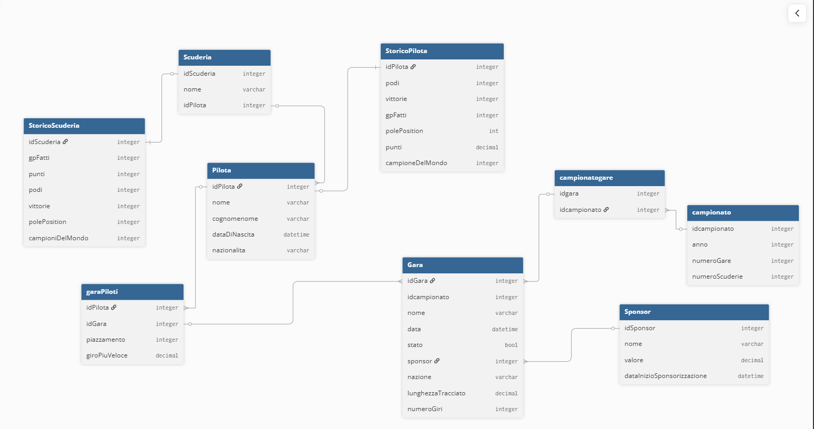

# Progetto-PCTO 

Questo progetto come tema ha la Formula 1: consiste in un sito web dove nella pagina principale statica viene mostrata 
la classifica della top  10 attuale nel campionato mondiale di F1 e i primi 3 piloti centrati nella pagina sono
i primi 3 nella classifica dei piloti. Nella barra di navigazione sono presenti 4 link dove l'immagine porta sempre alla home page,
'Piloti' porta nella pagina dei piloti dove sono presenti tutta la line-up del 2026, 'Scuderie' porta a una pagina con tutte le 
scuderie del 2026 e 'Campionati' porta a una pagina con dei vari campionati svolti in anni precedenti dove si possono vedere
i risultati di questi ultimi.

# Ambientei di sviluppo

Inizialmente per creare il diagramma delle varie tabelle, ho utilizzato dbDiagram.io, dove sono illustrate le varie classi
con i propri attributi e i collegamenti con le dipendenze;
Per creare un DataBase con le varie tabelle e valori, ho utilizzato SQL Management Studio;
Per la pagina web ho utilizzato Visual Studio con la quale ho collegato il DataBase.

# Diagramma

